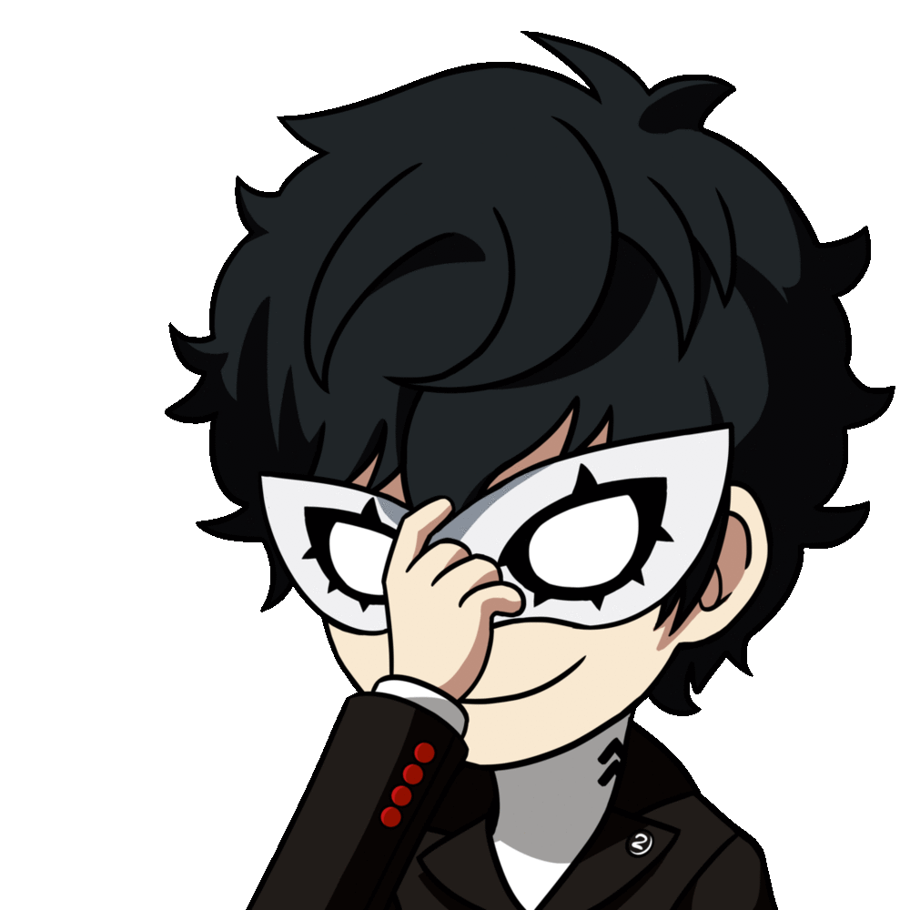
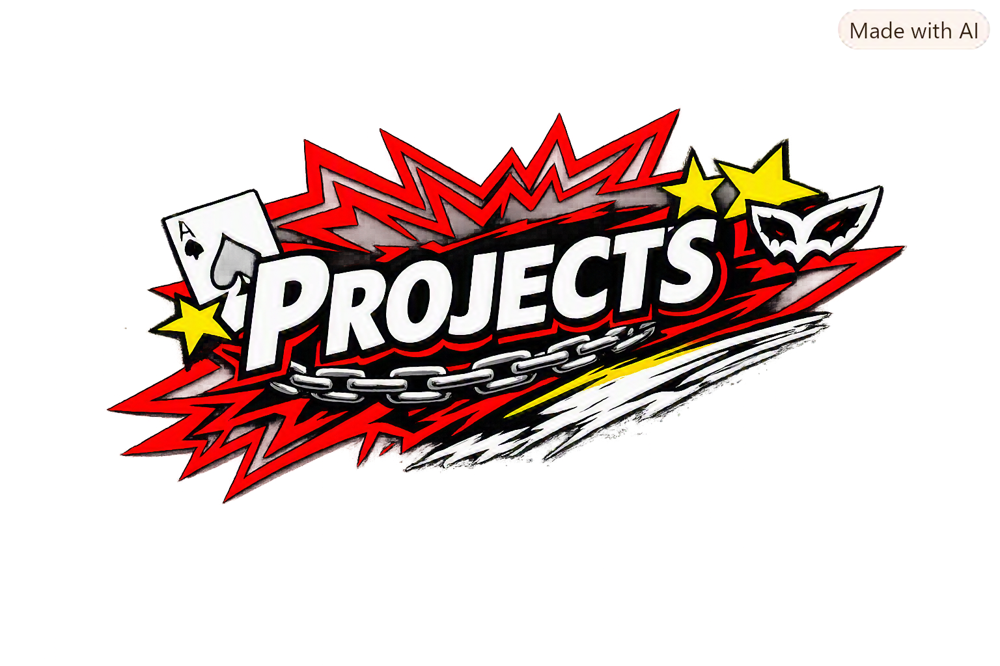

 

<table>
<tr>

<td width="65%" valign="top">

### 🔴 `TURNING IDEAS INTO INTERFACES`

Sou estudante de **Sistemas de Informação**, atualmente no **3º ano**, construindo minha jornada no desenvolvimento **Front-End**.

Minha trajetória começou no **Design Gráfico**, área em que desenvolvi minha formação na **Universidade Anhembi Morumbi**.

Foi no Front-End que encontrei uma maneira de unir essas duas áreas:

### 🔴 DESIGN + TECHNOLOGY

Gosto de transformar ideias em interfaces, trabalhando com composição visual, tipografia, cores, layouts, responsividade e interatividade.

Mais do que simplesmente escrever código, quero criar experiências que tenham **personalidade, propósito e identidade visual**.

 

`🔴 DESIGN` &nbsp; × &nbsp; `CODE` &nbsp; × &nbsp; `CREATIVITY`

</td>

<td width="35%" align="center" valign="middle">

<!-- GIF DO ABOUT ME -->

</td>

</tr>
</table>

---

 

 

<table>
<tr>

<td width="50%" valign="top">

## 🔴 DESIGN

### GRAPHIC DESIGN

**Universidade Anhembi Morumbi**

Minha formação em Design Gráfico influencia diretamente a maneira como penso interfaces e experiências digitais.

 

### 🔴 FOCUS

`COMPOSITION`  
`TYPOGRAPHY`  
`COLOR`  
`VISUAL IDENTITY`  
`USER EXPERIENCE`

</td>

<td width="50%" valign="top">

## ⚫ TECHNOLOGY

### SYSTEMS INFORMATION

**3rd Year**

Minha formação atual amplia minha visão sobre tecnologia, programação e desenvolvimento de sistemas.

 

### 🔴 FOCUS

`PROGRAMMING`  
`WEB DEVELOPMENT`  
`LOGIC`  
`SOFTWARE`  
`TECHNOLOGY`

</td>

</tr>
</table>

 

### 🔴 DESIGN + CODE = MY SPACE

---

 

### 🔴 `MY CURRENT ARSENAL`

 

&nbsp;&nbsp;

&nbsp;&nbsp;

&nbsp;&nbsp;

 

<table>
<tr>

<td align="center" width="25%">

### 🔴 HTML5

Structure  
Semantic HTML

</td>

<td align="center" width="25%">

### 🔴 CSS3

Layouts  
Responsive Design

</td>

<td align="center" width="25%">

### 🔴 JAVASCRIPT

Logic  
Interaction

</td>

<td align="center" width="25%">

### 🔴 PYTHON

Programming  
Logic

</td>

</tr>
</table>

---

## 🔴 ╱╱ 04 — WHAT I BUILD

### `CREATIVITY IN CODE`

 

<table>
<tr>

<td align="center" width="33%">

### 🔴 ◢

**WEBSITES**

</td>

<td align="center" width="33%">

### 🔴 ◢

**LANDING PAGES**

</td>

<td align="center" width="33%">

### 🔴 ◢

**INTERFACES**

</td>

</tr>

<tr>

<td align="center" width="33%">

### 🔴 ◢

**DASHBOARDS**

</td>

<td align="center" width="33%">

### 🔴 ◢

**INTERACTIVE UI**

</td>

<td align="center" width="33%">

### 🔴 ◢

**VISUAL PROJECTS**

</td>

</tr>
</table>

 

Meu objetivo é desenvolver projetos que combinem **funcionalidade e identidade visual**, utilizando programação como uma ferramenta para transformar conceitos em experiências digitais.

---

 

 

## 🔴 🃏 YASUO WIKI

> A Front-End Wiki project focused on design, organization and interactive content.

### 🔴 TECHNOLOGIES

`HTML5` `CSS3` `JAVASCRIPT`

### 🔴 FOCUS

`UI` · `LAYOUT` · `RESPONSIVENESS` · `INTERACTION`

 

---

## 🔴 ◢ PORTFOLIO PROJECTS

Projetos desenvolvidos durante minha evolução como desenvolvedor, explorando diferentes possibilidades dentro do desenvolvimento Web.

`FRONT-END` `UI` `UX` `JAVASCRIPT`

---

# 🔴 ╱╱ 06 — CURRENTLY LEARNING

<table>
<tr>

<td width="50%" valign="top">

### 🔴 JAVASCRIPT

Aprofundando:

`DOM`  
`EVENTS`  
`LOGIC`  
`APIs`  
`INTERACTIVITY`

</td>

<td width="50%" valign="top">

### 🔴 CSS

Explorando:

`RESPONSIVE DESIGN`  
`ADVANCED LAYOUTS`  
`ANIMATIONS`  
`UI`

</td>

</tr>

<tr>

<td width="50%" valign="top">

### 🔴 FRONT-END

Buscando melhorar cada vez mais minha capacidade de transformar conceitos visuais em experiências funcionais.

</td>

<td width="50%" valign="top">

### 🔴 PYTHON

Continuando meus estudos de programação e lógica através de projetos e cursos.

</td>

</tr>
</table>

---

# 🔴 ╱╱ 07 — EDUCATION

### 🔴 🎨 DESIGN GRÁFICO

**Universidade Anhembi Morumbi**

Formação em Design Gráfico.

---

### ⚫ 💻 SISTEMAS DE INFORMAÇÃO

**3º ANO**

Formação acadêmica voltada para tecnologia, sistemas e desenvolvimento.

---

### 🔴 📚 ALURA

Cursos complementares focados em programação e desenvolvimento.

---

---

# 🔴 ╱╱ 08 — MINDSET

## `I DON'T JUST WANT TO WRITE CODE.`

### 🔴 `I WANT TO CREATE SOMETHING PEOPLE WANT TO SEE.`

 

`DESIGN` → `CODE` → `EXPERIENCE`

 

---

 

# 🔴 TAKE YOUR TIME

### **SONHOS SÃO REALIDADES.**

 

`THIAGO LIMA`

### `DESIGN × CODE × CREATIVITY`

 

 

---

